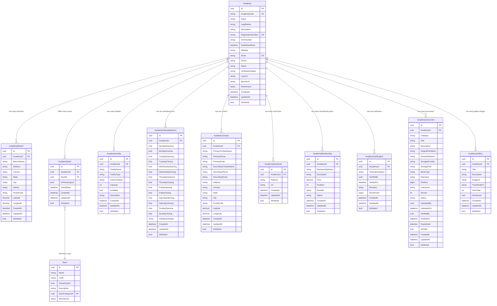

# Academy Domain - ER Diagram

## Relationship Summary

| Parent | Relationship | Child | FK | Delete Behavior |
|--------|-------------|-------|-----|-----------------|
| Academy | 1 : N | AcademyBranch | AcademyId | Cascade |
| Academy | 1 : N | AcademySport | AcademyId | Cascade |
| Academy | 1 : N | AcademyFacility | AcademyId | Cascade |
| Academy | 1 : 1 | AcademyOperatingHours | AcademyId | Cascade |
| Academy | 1 : 1 | AcademyContact | AcademyId | Cascade |
| Academy | 1 : N | AcademySocialLink | AcademyId | Cascade |
| Academy | 1 : N | AcademyMembership | AcademyId | Cascade |
| Academy | 1 : 1 | AcademyVerification | AcademyId | Cascade |
| Academy | 1 : N | AcademyDocument | AcademyId | Cascade |
| Academy | 1 : N | AcademyGallery | AcademyId | Cascade |
| Sport | 1 : N | AcademySport | SportId | Restrict |

## Unique Constraints

| Table | Columns | Notes |
|-------|---------|-------|
| Academies | AcademyCode | Unique academy code |
| Academies | Email | Unique email |
| Academies | RegistrationNumber | Unique (nullable filter) |
| AcademyBranches | AcademyId + BranchName | Unique branch per academy |
| AcademySports | AcademyId + SportId | Unique sport per academy |
| AcademySocialLinks | AcademyId + Platform | One link per platform |
| AcademyMemberships | AcademyId + MembershipName | Unique name per academy |
| AcademyContacts | AcademyId | One contact per academy |
| AcademyOperatingHours | AcademyId | One schedule per academy |
| AcademyVerifications | AcademyId | One verification per academy |

## Indexes

| Table | Index | Type |
|-------|-------|------|
| Academies | AcademyCode | Unique |
| Academies | Email | Unique |
| Academies | RegistrationNumber | Unique (partial) |
| Academies | Name | Non-unique |
| Academies | Phone | Non-unique |
| Academies | Status | Non-unique |
| Academies | VerificationStatus | Non-unique |
| Academies | Status + CreatedAt | Composite |
| AcademyBranches | AcademyId | Non-unique |
| AcademyBranches | AcademyId + BranchName | Unique |
| AcademyBranches | Country | Non-unique |
| AcademyBranches | State + City | Composite |
| AcademySports | AcademyId + SportId | Unique |
| AcademySports | AcademyId | Non-unique |
| AcademySports | SportId | Non-unique |
| AcademyFacilities | AcademyId | Non-unique |
| AcademyFacilities | FacilityType | Non-unique |
| AcademyFacilities | AcademyId + FacilityType | Composite |
| AcademyMemberships | AcademyId | Non-unique |
| AcademyMemberships | AcademyId + MembershipName | Unique |
| AcademyMemberships | Status | Non-unique |
| AcademyDocuments | AcademyId | Non-unique |
| AcademyDocuments | Category | Non-unique |
| AcademyDocuments | Status | Non-unique |
| AcademyDocuments | UploadedOn | Non-unique |
| AcademyDocuments | AcademyId + Category | Composite |
| AcademyDocuments | AcademyId + IsDeleted | Composite |
| AcademyGalleries | AcademyId | Non-unique |
| AcademyGalleries | AcademyId + SortOrder | Composite |
| AcademyGalleries | AcademyId + IsFeatured | Composite |
| AcademySocialLinks | AcademyId | Non-unique |
| AcademySocialLinks | AcademyId + Platform | Unique |
| AcademyOperatingHours | AcademyId | Unique |
| AcademyContacts | AcademyId | Unique |
| AcademyVerifications | AcademyId | Unique |
| AcademyVerifications | VerificationStatus | Non-unique |
