# Coach Domain — Entity Relationship Diagram

## Overview

The Coach Domain consists of **9 entities** centered around the `Coach` aggregate root, with 1:1, 1:N, and M:N relationships to `User`, `Sport`, and sub-entities.

---

## ER Diagram (Mermaid)

```mermaid
erDiagram
    BaseEntity {
        Guid Id PK
        DateTime CreatedAt
        DateTime UpdatedAt
        string CreatedBy
        string UpdatedBy
        bool IsDeleted
    }

    User ||--|| Coach : "1:1 via UserId"
    User ||--|| Athlete : "1:1 via UserId"
    User ||--o{ UserRole : "1:N"
    User ||--o{ RefreshToken : "1:N"

    Coach ||--o{ CoachSport : "1:N"
    Coach ||--o| CoachAvailability : "1:1"
    Coach ||--o| CoachLocation : "1:1"
    Coach ||--o{ CoachCertification : "1:N"
    Coach ||--o{ CoachExperience : "1:N"
    Coach ||--o{ CoachEducation : "1:N"
    Coach ||--o{ CoachSpecialization : "1:N"
    Coach ||--o{ CoachDocument : "1:N"

    Sport ||--o{ CoachSport : "1:N"
    Sport ||--o{ AthleteSport : "1:N"
    Sport }o--|| SportCategory : "N:1"

    Coach {
        Guid Id PK
        Guid UserId FK "1:1 with User"
        string CoachCode UK "COACH-YYYYMMDD-XXXX"
        DateTime RegistrationDate
        string Biography
        int YearsOfExperience
        string CurrentOrganization
        string HighestQualification
        string PreferredLanguage
        string CoachingLevel "enum: Junior..International"
        string Status "enum: Active..Rejected"
        string VerificationStatus "enum: Pending..Expired"
        byte[] RowVersion "optimistic concurrency"
        DateTime CreatedAt
        DateTime UpdatedAt
        bool IsDeleted
    }

    CoachAvailability {
        Guid Id PK
        Guid CoachId FK "1:1 with Coach"
        string WeeklySchedule "JSON string"
        string TimeSlots "JSON string"
        bool OnlineAvailable
        bool OfflineAvailable
        int TravelDistance "nullable, km"
        byte[] RowVersion "optimistic concurrency"
        DateTime CreatedAt
        DateTime UpdatedAt
        bool IsDeleted
    }

    CoachLocation {
        Guid Id PK
        Guid CoachId FK "1:1 with Coach"
        string Country "nullable"
        string State "nullable"
        string City "nullable"
        string District "nullable"
        decimal Latitude "precision(10,8)"
        decimal Longitude "precision(11,8)"
        DateTime CreatedAt
        DateTime UpdatedAt
        bool IsDeleted
    }

    CoachCertification {
        Guid Id PK
        Guid CoachId FK "N:1 with Coach"
        string CertificationName
        string IssuingAuthority "nullable"
        string CertificateNumber "nullable"
        DateTime IssueDate "nullable"
        DateTime ExpiryDate "nullable"
        string VerificationStatus "enum: Pending..Expired"
        string CertificateUrl "nullable"
        byte[] RowVersion "optimistic concurrency"
        DateTime CreatedAt
        DateTime UpdatedAt
        bool IsDeleted
    }

    CoachExperience {
        Guid Id PK
        Guid CoachId FK "N:1 with Coach"
        string Organization
        string Role "nullable"
        string Sport "nullable"
        DateTime StartDate
        DateTime EndDate "nullable"
        string Description "nullable"
        DateTime CreatedAt
        DateTime UpdatedAt
        bool IsDeleted
    }

    CoachEducation {
        Guid Id PK
        Guid CoachId FK "N:1 with Coach"
        string Degree
        string Institution "nullable"
        string FieldOfStudy "nullable"
        int YearCompleted "nullable"
        DateTime CreatedAt
        DateTime UpdatedAt
        bool IsDeleted
    }

    CoachSpecialization {
        Guid Id PK
        Guid CoachId FK "N:1 with Coach"
        string SpecializationName
        string Description "nullable"
        DateTime CreatedAt
        DateTime UpdatedAt
        bool IsDeleted
    }

    CoachDocument {
        Guid Id PK
        Guid CoachId FK "N:1 with Coach"
        string Category "enum: CoachDocumentCategory"
        string Title
        string Description "nullable"
        string OriginalFileName
        string StoredFileName
        string StorageProvider
        string StoragePath
        string MimeType
        string Extension
        long FileSize
        string Checksum "nullable, SHA-256"
        int Version
        string Status "enum: DocumentStatus"
        Guid UploadedBy "nullable"
        DateTime UploadedOn
        Guid VerifiedBy "nullable"
        DateTime VerifiedOn "nullable"
        DateTime ExpiryDate "nullable"
        bool IsPublic
        DateTime CreatedAt
        DateTime UpdatedAt
        bool IsDeleted
    }

    CoachSport {
        Guid Id PK
        Guid CoachId FK "N:1 with Coach"
        Guid SportId FK "N:1 with Sport"
        bool IsPrimarySport
        DateTime JoinedDate
        DateTime CreatedAt
        DateTime UpdatedAt
        bool IsDeleted
    }

    Sport {
        Guid Id PK
        string Name
        string Code
        bool OlympicSport
        string Description "nullable"
        Guid SportCategoryId FK
        byte[] RowVersion "optimistic concurrency"
        DateTime CreatedAt
        DateTime UpdatedAt
        bool IsDeleted
    }

    SportCategory {
        Guid Id PK
        string Name
        string Code
        string Description "nullable"
        byte[] RowVersion "optimistic concurrency"
        DateTime CreatedAt
        DateTime UpdatedAt
        bool IsDeleted
    }

    User {
        Guid Id PK
        string Email
        string PhoneNumber
        string PasswordHash
        string FullName
        string ProfileImageUrl "nullable"
        string Status "enum: UserStatus"
        string AuthMethod "enum: AuthenticationMethod"
        bool IsEmailVerified
        DateTime LastLoginAt "nullable"
        int FailedLoginAttempts
        DateTime LockoutEndAt "nullable"
        DateTime CreatedAt
        DateTime UpdatedAt
        bool IsDeleted
    }

    Athlete {
        Guid Id PK
        Guid UserId FK "1:1 with User"
        string AthleteCode UK
        DateTime RegistrationDate
        string CurrentLevel "enum: AthleteLevel"
        int ExperienceYears
        string Height "nullable"
        string Weight "nullable"
        string BloodGroup "nullable"
        string DominantHand "nullable"
        string DominantFoot "nullable"
        string Biography "nullable"
        string Status "enum: AthleteStatus"
        byte[] RowVersion "optimistic concurrency"
        DateTime CreatedAt
        DateTime UpdatedAt
        bool IsDeleted
    }

    AthleteSport {
        Guid Id PK
        Guid AthleteId FK "N:1 with Athlete"
        Guid SportId FK "N:1 with Sport"
        bool IsPrimarySport
        DateTime JoinedDate
        DateTime CreatedAt
        DateTime UpdatedAt
        bool IsDeleted
    }
```

---

## Relationship Summary

### Coach → Sub-entities

| Parent | Child | Type | FK | Cascade | Unique Index |
|--------|-------|------|-----|---------|-------------|
| Coach | CoachAvailability | **1:1** | CoachAvailability.CoachId | Cascade | `IX_CoachAvailabilities_CoachId` (unique) |
| Coach | CoachLocation | **1:1** | CoachLocation.CoachId | Cascade | `IX_CoachLocations_CoachId` (unique) |
| Coach | CoachCertification | **1:N** | CoachCertification.CoachId | Cascade | — |
| Coach | CoachExperience | **1:N** | CoachExperience.CoachId | Cascade | — |
| Coach | CoachEducation | **1:N** | CoachEducation.CoachId | Cascade | — |
| Coach | CoachSpecialization | **1:N** | CoachSpecialization.CoachId | Cascade | — |
| Coach | CoachDocument | **1:N** | CoachDocument.CoachId | Cascade | — |

### Many-to-Many

| Entity A | Entity B | Join Table | FK1 | FK2 | Unique Index |
|----------|----------|-----------|-----|-----|-------------|
| Coach | Sport | CoachSport | CoachId | SportId | `IX_CoachSports_CoachId_SportId` |
| Athlete | Sport | AthleteSport | AthleteId | SportId | — |

### User Relationships

| Parent | Child | Type | FK |
|--------|-------|------|-----|
| User | Coach | **1:1** | Coach.UserId |
| User | Athlete | **1:1** | Athlete.UserId |

---

## Database Indexes (Coach Tables)

### Coaches
| Index Name | Columns | Type |
|-----------|---------|------|
| `PK_Coaches` | Id | Primary Key |
| `IX_Coaches_UserId` | UserId | Unique |
| `IX_Coaches_CoachCode` | CoachCode | Unique |
| `IX_Coaches_Status` | Status | Non-unique |
| `IX_Coaches_CoachingLevel` | CoachingLevel | Non-unique |
| `IX_Coaches_VerificationStatus` | VerificationStatus | Non-unique |
| `IX_Coaches_Status_CoachingLevel` | Status, CoachingLevel | Composite |
| `IX_Coaches_Status_CreatedAt` | Status, CreatedAt | Composite |

### CoachAvailabilities
| Index Name | Columns | Type |
|-----------|---------|------|
| `PK_CoachAvailabilities` | Id | Primary Key |
| `IX_CoachAvailabilities_CoachId` | CoachId | Unique |

### CoachLocations
| Index Name | Columns | Type |
|-----------|---------|------|
| `PK_CoachLocations` | Id | Primary Key |
| `IX_CoachLocations_CoachId` | CoachId | Unique |
| `IX_CoachLocations_State_City` | State, City | Composite |

### CoachCertifications
| Index Name | Columns | Type |
|-----------|---------|------|
| `PK_CoachCertifications` | Id | Primary Key |
| `IX_CoachCertifications_CoachId` | CoachId | Non-unique |
| `IX_CoachCertifications_CoachId_Name` | CoachId, CertificationName | Composite |
| `IX_CoachCertifications_VerificationStatus` | VerificationStatus | Non-unique |

### CoachExperiences
| Index Name | Columns | Type |
|-----------|---------|------|
| `PK_CoachExperiences` | Id | Primary Key |
| `IX_CoachExperiences_CoachId` | CoachId | Non-unique |

### CoachEducation
| Index Name | Columns | Type |
|-----------|---------|------|
| `PK_CoachEducation` | Id | Primary Key |
| `IX_CoachEducation_CoachId` | CoachId | Non-unique |

### CoachSpecializations
| Index Name | Columns | Type |
|-----------|---------|------|
| `PK_CoachSpecializations` | Id | Primary Key |
| `IX_CoachSpecializations_CoachId` | CoachId | Non-unique |
| `IX_CoachSpecializations_CoachId_Name` | CoachId, SpecializationName | Unique |

### CoachDocuments
| Index Name | Columns | Type |
|-----------|---------|------|
| `PK_CoachDocuments` | Id | Primary Key |
| `IX_CoachDocuments_CoachId` | CoachId | Non-unique |
| `IX_CoachDocuments_CoachId_Category` | CoachId, Category | Composite |
| `IX_CoachDocuments_CoachId_IsDeleted` | CoachId, IsDeleted | Composite |
| `IX_CoachDocuments_Category` | Category | Non-unique |
| `IX_CoachDocuments_Status` | Status | Non-unique |
| `IX_CoachDocuments_UploadedOn` | UploadedOn | Non-unique |

### CoachSports
| Index Name | Columns | Type |
|-----------|---------|------|
| `PK_CoachSports` | Id | Primary Key |
| `IX_CoachSports_CoachId` | CoachId | Non-unique |
| `IX_CoachSports_CoachId_SportId` | CoachId, SportId | Unique |
| `IX_CoachSports_SportId` | SportId | Non-unique |

---

## Seed Data

### Coach (1 record)
| Field | Value |
|-------|-------|
| Id | `d1000000-0000-0000-0000-000000000001` |
| UserId | `f47ac10b-58cc-4372-a567-0e02b2c3d479` |
| CoachCode | `COACH-20250101-SEED01` |
| CoachingLevel | Senior |
| Status | Active |
| VerificationStatus | Verified |
| YearsOfExperience | 5 |

### CoachCertification (1 record)
| Field | Value |
|-------|-------|
| Id | `e1000000-0000-0000-0000-000000000001` |
| CertificationName | BCCI Level A Coaching |
| IssuingAuthority | Board of Control for Cricket in India |
| CertificateNumber | BCCI-LA-2024-001 |
| VerificationStatus | Verified |

### CoachExperience (1 record)
| Field | Value |
|-------|-------|
| Id | `f1000000-0000-0000-0000-000000000001` |
| Organization | State Cricket Academy |
| Role | Head Coach |
| Sport | Cricket |

### CoachEducation (1 record)
| Field | Value |
|-------|-------|
| Id | `a2000000-0000-0000-0000-000000000001` |
| Degree | Bachelor of Physical Education |
| Institution | National Institute of Sports |
| FieldOfStudy | Sports Coaching |
| YearCompleted | 2018 |

### CoachAvailability (1 record)
| Field | Value |
|-------|-------|
| Id | `b2000000-0000-0000-0000-000000000001` |
| WeeklySchedule | JSON (Mon-Fri 06:00-18:00, Sat 08:00-14:00) |
| TimeSlots | JSON (6 slots, 2-hour blocks) |
| OnlineAvailable | true |
| OfflineAvailable | true |
| TravelDistance | 25 km |

### CoachLocation (1 record)
| Field | Value |
|-------|-------|
| Id | `c2000000-0000-0000-0000-000000000001` |
| Country | India |
| State | Maharashtra |
| City | Mumbai |
| District | Mumbai City |
| Latitude | 19.07600000 |
| Longitude | 72.87770000 |

### CoachSpecialization (2 records)
| Id | SpecializationName | Description |
|----|-------------------|-------------|
| `d2000000-0000-0000-0000-000000000001` | Fast Bowling | Specialized in pace and swing bowling techniques |
| `d2000000-0000-0000-0000-000000000002` | Fielding | Specialized in fielding drills and athleticism |

---

## Enums Reference

### CoachingLevel
| Value | Name |
|-------|------|
| 0 | Assistant |
| 1 | Junior |
| 2 | Intermediate |
| 3 | Senior |
| 4 | Expert |
| 5 | Master |
| 6 | International |

### CoachStatus
| Value | Name |
|-------|------|
| 0 | Active |
| 1 | Inactive |
| 2 | Suspended |
| 3 | Pending |
| 4 | Rejected |

### VerificationStatus
| Value | Name |
|-------|------|
| 0 | Pending |
| 1 | Verified |
| 2 | Rejected |
| 3 | Expired |

### CoachDocumentCategory
| Value | Name |
|-------|------|
| 0 | Certificate |
| 1 | License |
| 2 | Resume |
| 3 | Photo |
| 4 | IdentityProof |
| 5 | CoachingPlan |
| 6 | Video |
| 7 | Other |

---

## Migration

**Migration Name:** `AddCoachDomain`
**Timestamp:** `20260723102244`

### Tables Created (Up)
- `Coaches`
- `CoachAvailabilities`
- `CoachCertifications`
- `CoachDocuments`
- `CoachEducation`
- `CoachExperiences`
- `CoachLocations`
- `CoachSpecializations`
- `CoachSports`
- `AthleteDocuments`
- `DocumentAudits`
- `DocumentVersions`
- `RecentSearches`
- `SavedSearches`

### Indexes Created (Up)
- 8 Coach indexes on `Coaches`
- 1 index on `CoachAvailabilities`
- 3 indexes on `CoachLocations`
- 4 indexes on `CoachCertifications`
- 1 index on `CoachExperiences`
- 1 index on `CoachEducation`
- 3 indexes on `CoachSpecializations`
- 6 indexes on `CoachDocuments`
- 3 indexes on `CoachSports`
- Additional Athlete/document/search indexes

### Down Migration
Drops all Coach tables + AthleteDocuments, DocumentAudits, DocumentVersions, RecentSearches, SavedSearches and associated indexes.

---

## Concurrency Control

| Entity | Strategy |
|--------|----------|
| Coach | `RowVersion` (bytea, rowVersion=true) |
| CoachAvailability | `RowVersion` (bytea, rowVersion=true) |
| CoachCertification | `RowVersion` (bytea, rowVersion=true) |

All other sub-entities use `Guid` primary keys without optimistic concurrency (sufficient for their access patterns).
