# Event Management Domain - ER Diagram

```mermaid
erDiagram
    Event {
        uuid Id PK
        string EventCode UK
        string EventName
        string Description
        string ShortDescription
        uuid AcademyId FK
        uuid SportId FK
        uuid EventTypeId FK
        uuid EventCategoryId FK
        string Status
        string RegistrationType
        datetime StartDate
        datetime EndDate
        datetime RegistrationOpenDate
        datetime RegistrationCloseDate
        int MaxParticipants
        int MinParticipants
        decimal RegistrationFee
        bool IsFeatured
        bool IsPublic
        string BannerUrl
        string ContactEmail
        string ContactPhone
        string Website
        string Tags
        string Requirements
        string WhatToBring
        string CancellationPolicy
        bytea RowVersion
        datetime CreatedAt
        datetime UpdatedAt
        bool IsDeleted
    }

    EventTypeEntity {
        uuid Id PK
        string Name
        string Code UK
        string Description
        bool IsActive
        int DisplayOrder
        bytea RowVersion
        datetime CreatedAt
        datetime UpdatedAt
        bool IsDeleted
    }

    EventCategory {
        uuid Id PK
        string Name
        string Code UK
        string Description
        string CategoryType
        bool IsActive
        int DisplayOrder
        bytea RowVersion
        datetime CreatedAt
        datetime UpdatedAt
        bool IsDeleted
    }

    EventSchedule {
        uuid Id PK
        uuid EventId FK
        datetime ScheduleDate
        time StartTime
        time EndTime
        string Title
        string Description
        bool IsAllDay
        string RecurrenceRule
        bytea RowVersion
        datetime CreatedAt
        datetime UpdatedAt
        bool IsDeleted
    }

    EventVenue {
        uuid Id PK
        uuid EventId FK
        uuid FacilityId FK
        string VenueName
        string Address
        string City
        string State
        string Country
        string PostalCode
        decimal Latitude
        decimal Longitude
        int Capacity
        string MapUrl
        string Instructions
        bool IsPrimary
        bytea RowVersion
        datetime CreatedAt
        datetime UpdatedAt
        bool IsDeleted
    }

    EventRegistration {
        uuid Id PK
        uuid EventId FK
        uuid AthleteId FK
        uuid UserId FK
        string RegistrationNumber UK
        string Status
        decimal AmountPaid
        string PaymentReference
        string Notes
        datetime RegistrationDate
        datetime ApprovalDate
        string RejectionReason
        int WaitlistPosition
        bytea RowVersion
        datetime CreatedAt
        datetime UpdatedAt
        bool IsDeleted
    }

    EventParticipant {
        uuid Id PK
        uuid EventId FK
        uuid AthleteId FK
        uuid UserId FK
        uuid RegistrationId FK
        string ParticipantName
        string Email
        string Phone
        string AttendanceStatus
        string Role
        string Organization
        string DietaryRequirements
        string SpecialNeeds
        bytea RowVersion
        datetime CreatedAt
        datetime UpdatedAt
        bool IsDeleted
    }

    EventSpeaker {
        uuid Id PK
        uuid EventId FK
        uuid UserId FK
        uuid CoachId FK
        string SpeakerName
        string Email
        string Phone
        string Title
        string Bio
        string ProfileImageUrl
        string Organization
        string Role
        string Topic
        int DisplayOrder
        bytea RowVersion
        datetime CreatedAt
        datetime UpdatedAt
        bool IsDeleted
    }

    EventCoach {
        uuid Id PK
        uuid EventId FK
        uuid CoachId FK
        string Role
        string Responsibility
        bool IsLeadCoach
        string Notes
        bytea RowVersion
        datetime CreatedAt
        datetime UpdatedAt
        bool IsDeleted
    }

    EventVolunteer {
        uuid Id PK
        uuid EventId FK
        uuid UserId FK
        string VolunteerName
        string Email
        string Phone
        string Role
        string Assignment
        datetime CheckInTime
        datetime CheckOutTime
        string Notes
        bytea RowVersion
        datetime CreatedAt
        datetime UpdatedAt
        bool IsDeleted
    }

    EventSponsor {
        uuid Id PK
        uuid EventId FK
        string SponsorName
        string ContactPerson
        string ContactEmail
        string ContactPhone
        string Website
        string LogoUrl
        decimal ContributionAmount
        string ContributionDescription
        string Tier
        int DisplayOrder
        string Notes
        bytea RowVersion
        datetime CreatedAt
        datetime UpdatedAt
        bool IsDeleted
    }

    EventSession {
        uuid Id PK
        uuid EventId FK
        string SessionCode UK
        string Title
        string Description
        datetime SessionDate
        time StartTime
        time EndTime
        uuid VenueId FK
        uuid SpeakerId FK
        uuid CoachId FK
        string Status
        int Capacity
        int CurrentAttendeeCount
        bool IsBreak
        string Notes
        bytea RowVersion
        datetime CreatedAt
        datetime UpdatedAt
        bool IsDeleted
    }

    EventAgenda {
        uuid Id PK
        uuid EventId FK
        uuid SessionId FK
        int DisplayOrder
        datetime StartTime
        datetime EndTime
        string Title
        string Description
        string SpeakerName
        string Location
        bytea RowVersion
        datetime CreatedAt
        datetime UpdatedAt
        bool IsDeleted
    }

    EventTicket {
        uuid Id PK
        uuid EventId FK
        string TicketCode UK
        string TicketType
        string Description
        decimal Price
        int QuantityAvailable
        int QuantitySold
        int MaxPerPerson
        datetime SaleStartDate
        datetime SaleEndDate
        bool IsActive
        bytea RowVersion
        datetime CreatedAt
        datetime UpdatedAt
        bool IsDeleted
    }

    EventAttendance {
        uuid Id PK
        uuid EventId FK
        uuid SessionId FK
        uuid ParticipantId FK
        string Status
        datetime CheckInTime
        datetime CheckOutTime
        string Remarks
        string MarkedBy
        bytea RowVersion
        datetime CreatedAt
        datetime UpdatedAt
        bool IsDeleted
    }

    EventCertificate {
        uuid Id PK
        uuid EventId FK
        uuid ParticipantId FK
        string CertificateNumber UK
        string CertificateType
        datetime IssuedDate
        string IssuedBy
        string DocumentUrl
        bool IsPrinted
        bool IsSent
        string Notes
        bytea RowVersion
        datetime CreatedAt
        datetime UpdatedAt
        bool IsDeleted
    }

    EventFeedback {
        uuid Id PK
        uuid EventId FK
        uuid ParticipantId FK
        uuid UserId FK
        string OverallRating
        string ContentRating
        string SpeakerRating
        string VenueRating
        string OrganizationRating
        string Comments
        string Suggestions
        bool WouldRecommend
        bool IsAnonymous
        bytea RowVersion
        datetime CreatedAt
        datetime UpdatedAt
        bool IsDeleted
    }

    EventMedia {
        uuid Id PK
        uuid EventId FK
        string MediaType
        string Title
        string Description
        string Url
        string ThumbnailUrl
        string FileName
        long FileSize
        string ContentType
        bool IsFeatured
        int DisplayOrder
        uuid UploadedBy
        bytea RowVersion
        datetime CreatedAt
        datetime UpdatedAt
        bool IsDeleted
    }

    EventDocument {
        uuid Id PK
        uuid EventId FK
        string DocumentType
        string Title
        string Description
        string Url
        string FileName
        long FileSize
        string ContentType
        bool IsPublic
        int Version
        uuid UploadedBy
        bytea RowVersion
        datetime CreatedAt
        datetime UpdatedAt
        bool IsDeleted
    }

    EventAnnouncement {
        uuid Id PK
        uuid EventId FK
        string Title
        string Message
        bool IsPublished
        datetime PublishedAt
        uuid PublishedBy
        bool SendNotification
        string Priority
        bytea RowVersion
        datetime CreatedAt
        datetime UpdatedAt
        bool IsDeleted
    }

    Academy ||--o{ Event : "hosts"
    Sport ||--o{ Event : "associated with"
    EventTypeEntity ||--o{ Event : "categorized by"
    EventCategory ||--o{ Event : "classified under"
    Event ||--o{ EventSchedule : "has schedules"
    Event ||--o{ EventVenue : "held at venues"
    Event ||--o{ EventRegistration : "accepts registrations"
    Event ||--o{ EventParticipant : "has participants"
    Event ||--o{ EventSpeaker : "features speakers"
    Event ||--o{ EventCoach : "assigns coaches"
    Event ||--o{ EventVolunteer : "has volunteers"
    Event ||--o{ EventSponsor : "sponsored by"
    Event ||--o{ EventSession : "contains sessions"
    Event ||--o{ EventAgenda : "has agenda"
    Event ||--o{ EventTicket : "offers tickets"
    Event ||--o{ EventAttendance : "tracks attendance"
    Event ||--o{ EventCertificate : "issues certificates"
    Event ||--o{ EventFeedback : "collects feedback"
    Event ||--o{ EventMedia : "has media"
    Event ||--o{ EventDocument : "has documents"
    Event ||--o{ EventAnnouncement : "publishes announcements"

    EventVenue }o--|| Facility : "at facility"
    EventRegistration }o--o| Athlete : "registered by athlete"
    EventRegistration }o--o| User : "registered by user"
    EventParticipant }o--o| Athlete : "is athlete"
    EventParticipant }o--o| User : "is user"
    EventParticipant }o--o| EventRegistration : "from registration"
    EventSpeaker }o--o| User : "is user"
    EventSpeaker }o--o| Coach : "is coach"
    EventCoach }o--|| Coach : "assigned coach"
    EventVolunteer }o--o| User : "is user"
    EventSession }o--o| EventVenue : "at venue"
    EventSession }o--o| EventSpeaker : "led by speaker"
    EventSession }o--o| EventCoach : "led by coach"
    EventAgenda }o--o| EventSession : "linked to session"
    EventAttendance }o--|| EventParticipant : "for participant"
    EventAttendance }o--o| EventSession : "in session"
    EventCertificate }o--|| EventParticipant : "awarded to participant"
    EventFeedback }o--o| EventParticipant : "from participant"
    EventFeedback }o--o| User : "by user"
```

## Relationships Summary

| Relationship | Description |
|---|---|
| Academy → Event | Academy hosts events |
| Sport → Event | Events are associated with sports |
| EventTypeEntity → Event | Events are categorized by type (Camp, Workshop, Seminar, etc.) |
| EventCategory → Event | Events are classified under categories |
| Event → EventSchedule | Events have multiple schedule slots |
| Event → EventVenue | Events can have multiple venues (main + secondary) |
| Event → EventRegistration | Events accept registrations |
| Event → EventParticipant | Events track participants |
| Event → EventSpeaker | Events feature speakers/panelists |
| Event → EventCoach | Events assign coaches |
| Event → EventVolunteer | Events have volunteers |
| Event → EventSponsor | Events have sponsors |
| Event → EventSession | Events contain sessions/workshops |
| Event → EventAgenda | Events have agenda items |
| Event → EventTicket | Events offer ticket types |
| Event → EventAttendance | Events track attendance |
| Event → EventCertificate | Events issue certificates |
| Event → EventFeedback | Events collect feedback |
| Event → EventMedia | Events have media files |
| Event → EventDocument | Events have documents |
| Event → EventAnnouncement | Events publish announcements |
| Facility → EventVenue | Venues can reference existing facilities |
| Athlete/User → EventRegistration | Registrations link to users/athletes |
| Coach → EventCoach/EventSpeaker | Coaches can be assigned as coaches or speakers |

## Seed Data

### Event Types (10 records)
| Code | Name |
|---|---|
| CAMP | Camp |
| WORKSHOP | Workshop |
| SEMINAR | Seminar |
| COACHING_CLINIC | Coaching Clinic |
| TRIAL | Trial |
| TALENT_HUNT | Talent Hunt |
| COMPETITION | Competition |
| COMMUNITY_EVENT | Community Event |
| SPORTS_FESTIVAL | Sports Festival |
| WEBINAR | Webinar |

### Event Categories (10 records)
| Code | Name | CategoryType |
|---|---|---|
| SPORTS_TRAINING | Sports Training | SportsTraining |
| EDUCATION | Education | Education |
| NETWORKING | Networking | Networking |
| HEALTH | Health | Health |
| TALENT_DEV | Talent Development | TalentDevelopment |
| COMMUNITY_OUTREACH | Community Outreach | CommunityOutreach |
| PROFESSIONAL | Professional | Professional |
| RECREATIONAL | Recreational | Recreational |
| COMPETITIVE | Competitive | Competitive |
| MIXED | Mixed | Mixed |
