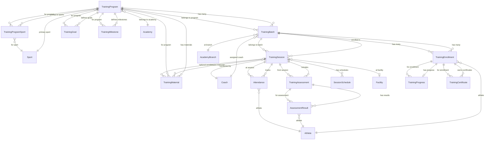

# Training Programs & Sessions - ER Diagram

## Entity Relationship Diagram

## Table Details

### TrainingPrograms
| Column | Type | Constraints |
|--------|------|-------------|
| Id | uuid | PK |
| ProgramCode | varchar(50) | UNIQUE, NOT NULL |
| ProgramName | varchar(200) | NOT NULL |
| SportId | uuid | FK → Sports, RESTRICT |
| AcademyId | uuid | FK → Academies, CASCADE |
| Description | varchar(2000) | NULL |
| DifficultyLevel | varchar(30) | NOT NULL |
| MinimumAge | int | NOT NULL |
| MaximumAge | int | NOT NULL |
| DurationWeeks | int | NOT NULL |
| Capacity | int | NOT NULL |
| Status | varchar(30) | NOT NULL |
| RowVersion | bytea | ROW VERSION |
| CreatedAt | timestamptz | NOT NULL |
| UpdatedAt | timestamptz | NULL |
| IsDeleted | boolean | NOT NULL |

**Indexes:** IX_ProgramCode (UNIQUE), IX_ProgramName, IX_AcademyId, IX_SportId, IX_Status, IX_DifficultyLevel, IX_AcademyId_Status, IX_SportId_Status

### TrainingProgramSports
| Column | Type | Constraints |
|--------|------|-------------|
| Id | uuid | PK |
| TrainingProgramId | uuid | FK → TrainingPrograms, CASCADE |
| SportId | uuid | FK → Sports, RESTRICT |
| IsPrimarySport | boolean | NOT NULL |

**Indexes:** IX_ProgramId_SportId (UNIQUE)

### TrainingBatches
| Column | Type | Constraints |
|--------|------|-------------|
| Id | uuid | PK |
| ProgramId | uuid | FK → TrainingPrograms, CASCADE |
| BatchCode | varchar(50) | UNIQUE, NOT NULL |
| CoachId | uuid | FK → Coaches, RESTRICT |
| BranchId | uuid | FK → AcademyBranches, RESTRICT |
| StartDate | timestamptz | NOT NULL |
| EndDate | timestamptz | NULL |
| MaximumSeats | int | NOT NULL |
| Status | varchar(30) | NOT NULL |
| RowVersion | bytea | ROW VERSION |

**Indexes:** IX_BatchCode (UNIQUE), IX_ProgramId, IX_CoachId, IX_BranchId, IX_Status, IX_ProgramId_Status, IX_CoachId_StartDate

### TrainingSessions
| Column | Type | Constraints |
|--------|------|-------------|
| Id | uuid | PK |
| BatchId | uuid | FK → TrainingBatches, CASCADE |
| SessionCode | varchar(50) | UNIQUE, NOT NULL |
| SessionTitle | varchar(200) | NOT NULL |
| SessionType | varchar(30) | NOT NULL |
| SessionDate | timestamptz | NOT NULL |
| StartTime | interval | NOT NULL |
| EndTime | interval | NOT NULL |
| FacilityId | uuid | FK → Facilities, SET NULL |
| CoachId | uuid | FK → Coaches, RESTRICT |
| Status | varchar(30) | NOT NULL |
| RowVersion | bytea | ROW VERSION |

**Indexes:** IX_SessionCode (UNIQUE), IX_BatchId, IX_CoachId, IX_FacilityId, IX_SessionDate, IX_Status, IX_SessionType, IX_BatchId_SessionDate, IX_CoachId_SessionDate

### SessionSchedules
| Column | Type | Constraints |
|--------|------|-------------|
| Id | uuid | PK |
| SessionId | uuid | FK → TrainingSessions, CASCADE |
| DayOfWeek | int | NOT NULL |
| StartTime | interval | NOT NULL |
| EndTime | interval | NOT NULL |
| IsRecurring | boolean | NOT NULL |
| Notes | varchar(500) | NULL |

**Indexes:** IX_SessionId, IX_SessionId_DayOfWeek

### TrainingEnrollments
| Column | Type | Constraints |
|--------|------|-------------|
| Id | uuid | PK |
| BatchId | uuid | FK → TrainingBatches, CASCADE |
| AthleteId | uuid | FK → Athletes, RESTRICT |
| EnrollmentDate | timestamptz | NOT NULL |
| Status | varchar(30) | NOT NULL |
| RowVersion | bytea | ROW VERSION |

**Indexes:** IX_BatchId, IX_AthleteId, IX_Status, IX_BatchId_AthleteId (UNIQUE), IX_AthleteId_Status

### Attendances
| Column | Type | Constraints |
|--------|------|-------------|
| Id | uuid | PK |
| SessionId | uuid | FK → TrainingSessions, CASCADE |
| AthleteId | uuid | FK → Athletes, RESTRICT |
| AttendanceStatus | varchar(30) | NOT NULL |
| CheckInTime | timestamptz | NULL |
| CheckOutTime | timestamptz | NULL |
| Remarks | varchar(500) | NULL |

**Indexes:** IX_SessionId, IX_AthleteId, IX_AttendanceStatus, IX_SessionId_AthleteId (UNIQUE), IX_SessionId_Status

### TrainingAssessments
| Column | Type | Constraints |
|--------|------|-------------|
| Id | uuid | PK |
| SessionId | uuid | FK → TrainingSessions, CASCADE |
| AssessmentType | varchar(30) | NOT NULL |
| AssessmentName | varchar(200) | NOT NULL |
| MaximumScore | numeric(10,2) | NOT NULL |
| PassingScore | numeric(10,2) | NOT NULL |
| RowVersion | bytea | ROW VERSION |

**Indexes:** IX_SessionId, IX_AssessmentType, IX_SessionId_Type

### AssessmentResults
| Column | Type | Constraints |
|--------|------|-------------|
| Id | uuid | PK |
| AssessmentId | uuid | FK → TrainingAssessments, CASCADE |
| AthleteId | uuid | FK → Athletes, RESTRICT |
| Score | numeric(10,2) | NOT NULL |
| IsPassed | boolean | NOT NULL |
| Remarks | varchar(500) | NULL |
| AssessedAt | timestamptz | NOT NULL |

**Indexes:** IX_AssessmentId, IX_AthleteId, IX_AssessmentId_AthleteId (UNIQUE), IX_IsPassed

### TrainingGoals
| Column | Type | Constraints |
|--------|------|-------------|
| Id | uuid | PK |
| ProgramId | uuid | FK → TrainingPrograms, CASCADE |
| GoalName | varchar(200) | NOT NULL |
| Description | varchar(2000) | NULL |
| TargetWeek | int | NOT NULL |
| IsAchieved | boolean | NOT NULL |

**Indexes:** IX_ProgramId, IX_ProgramId_TargetWeek

### TrainingMilestones
| Column | Type | Constraints |
|--------|------|-------------|
| Id | uuid | PK |
| ProgramId | uuid | FK → TrainingPrograms, CASCADE |
| MilestoneName | varchar(200) | NOT NULL |
| Description | varchar(2000) | NULL |
| WeekNumber | int | NOT NULL |
| IsCompleted | boolean | NOT NULL |

**Indexes:** IX_ProgramId, IX_ProgramId_WeekNumber

### TrainingProgresses
| Column | Type | Constraints |
|--------|------|-------------|
| Id | uuid | PK |
| EnrollmentId | uuid | FK → TrainingEnrollments, CASCADE, UNIQUE |
| CurrentLevel | varchar(50) | NOT NULL |
| CompletedPercentage | numeric(5,2) | NOT NULL |
| OverallRating | numeric(5,2) | NULL |
| RowVersion | bytea | ROW VERSION |

**Indexes:** IX_EnrollmentId (UNIQUE)

### TrainingCertificates
| Column | Type | Constraints |
|--------|------|-------------|
| Id | uuid | PK |
| EnrollmentId | uuid | FK → TrainingEnrollments, CASCADE |
| CertificateType | varchar(30) | NOT NULL |
| CertificateNumber | varchar(100) | UNIQUE, NOT NULL |
| IssuedDate | timestamptz | NOT NULL |
| FileUrl | varchar(500) | NULL |
| RowVersion | bytea | ROW VERSION |

**Indexes:** IX_EnrollmentId, IX_CertificateNumber (UNIQUE), IX_CertificateType

### TrainingMaterials
| Column | Type | Constraints |
|--------|------|-------------|
| Id | uuid | PK |
| ProgramId | uuid | FK → TrainingPrograms, CASCADE |
| SessionId | uuid | FK → TrainingSessions, SET NULL |
| Title | varchar(200) | NOT NULL |
| Description | varchar(2000) | NULL |
| MaterialType | varchar(30) | NOT NULL |
| FileUrl | varchar(500) | NOT NULL |
| SortOrder | int | NOT NULL |

**Indexes:** IX_ProgramId, IX_SessionId, IX_MaterialType, IX_ProgramId_SortOrder
