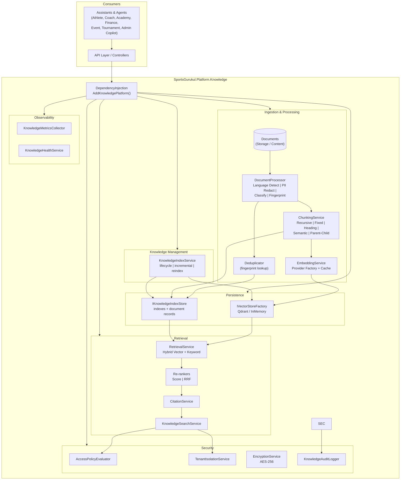

# Enterprise Knowledge & RAG Platform

## Overview

The Knowledge Platform (`SportsGurukul.Platform.Knowledge`) is a reusable, provider- and
vector-database-agnostic library that gives every assistant and agent in the Sports Gurukul
ecosystem a production-grade Retrieval-Augmented Generation (RAG) pipeline:

- **Ingestion** of documents (PDF, Word, Excel, PowerPoint, Markdown, HTML, TXT, CSV, JSON, XML)
- **Document processing** with language detection, PII redaction, content classification, and
  fingerprint-based deduplication
- **Chunking** with multiple strategies (recursive, fixed-size, sliding-window, heading-based,
  semantic, parent-child)
- **Embedding** behind a single abstraction (OpenAI, Azure OpenAI, Gemini, Cohere, Ollama,
  deterministic local mode)
- **Vector storage** behind a single abstraction (Qdrant, in-memory)
- **Retrieval** with hybrid search (vector + BM25 keyword), score and RRF re-ranking, and a
  citation engine
- **Knowledge management** with index lifecycle, incremental indexing, re-indexing, archive,
  restore, and delete
- **Security** with zero-trust access policies, tenant isolation, AES-256 encryption, and an
  audit trail
- **Observability** with metrics collection and a health service

The library follows Clean Architecture principles and is intentionally decoupled from the
Athlete, Coach, Academy, Finance, Event, and Tournament domain modules. It references only
`Microsoft.Extensions.*` abstractions and exposes a single DI extension method.

## Architecture



## Pipeline

1. **Resolve index** — get-or-create the target `KnowledgeIndex`; archived or deleted indexes
   reject ingestion.
2. **Process** — `DocumentProcessor` extracts text via the `ITextExtractorRegistry`, normalizes
   it, detects language, redacts PII, classifies content (Sport/Finance/…), and computes a
   canonical SHA-256 fingerprint.
3. **Deduplicate** — the fingerprint is compared against already-indexed documents; identical
   content is reported as `DuplicateSkipped`.
4. **Chunk** — the safe text is split into `DocumentChunk`s by the configured strategy.
5. **Enrich** — each chunk receives metadata (`document_id`, `document_title`, `classification`,
   `language`, `source_link`, …).
6. **Embed** — chunks are embedded in batches via the configured `IEmbeddingProvider`.
7. **Upsert** — chunk vectors are written to the vector store; the `KnowledgeDocumentRecord` and
   index counters are updated in the index store.
8. **Audit & metrics** — every ingest, delete, and search is audited and metered.

Search follows the Embed → Retrieve → Rank → Generate flow defined in
`docs/ai-coach-langgraph/RAG_Pipeline.md`:

1. **Embed** the query and run vector search (cosine similarity).
2. **Keyword** search runs BM25 over the same collection.
3. **Fuse** the result sets (weighted hybrid or RRF).
4. **Re-rank** with the configured `IReranker`.
5. **Cite** — build `Citation`s from chunk metadata so generated answers can reference sources.

## Project Layout

```
backend/src/SportsGurukul.Platform.Knowledge/
  DependencyInjection.cs          AddKnowledgePlatform() registration
  Abstractions/                   Public service interfaces (pure abstractions)
  Models/                         Records, enums, options (KnowledgeDocument, DocumentChunk, ...)
  Configuration/                  KnowledgePlatformOptions + section bindings
  Processing/                     Text extraction, language, PII, classifier, fingerprint, dedup
  Chunking/                       ChunkingService + 6 chunker strategies + registry
  Embedding/                      Provider factory, cache, HTTP and local providers
  VectorStores/                   InMemory + Qdrant, VectorMath (cosine, BM25)
  Retrieval/                      RetrievalService, re-rankers, CitationService, KnowledgeSearchService
  Indexing/                       InMemoryIndexStore, KnowledgeIngestionService, KnowledgeIndexService
  Security/                       Access policy, tenant isolation, encryption, audit logger
  Observability/                  Metrics collector, health service
```

`backend/tests/SportsGurukul.Platform.Knowledge.Tests/` holds 48 xUnit tests covering every
subsystem plus DI wiring.

## Registration

```csharp
services.AddKnowledgePlatform(
    configuration,                     // binds "KnowledgePlatform" section
    options => { options.Chunking.ChunkSize = 512; });
```

Configuration is bound from the `KnowledgePlatform` section (`KnowledgePlatformOptions`):

| Section | Key settings (defaults) |
|---|---|
| `KnowledgePlatform:Embedding` | `Provider=deterministic`, `BatchSize=64`, `Dimensions=384`, `ApiKey`, `BaseUrl`, `Model` |
| `KnowledgePlatform:VectorStore` | `Provider=inmemory`, `BaseUrl`, `ApiKey`, `CollectionPrefix` |
| `KnowledgePlatform:Chunking` | `Strategy=Recursive`, `ChunkSize=512`, `ChunkOverlap=64`, `MinChunkSize=64` |
| `KnowledgePlatform:Retrieval` | `DefaultMode=Hybrid`, `DefaultTopK=10`, `Reranker=score`, `VectorWeight=0.7` |
| `KnowledgePlatform:Security` | `EncryptionKeyBase64`, `EnableAudit=true`, `EnforceTenantIsolation=true` |
| `KnowledgePlatform:Observability` | `LatencySampleLimit=1000` |

### Example

```json
{
  "KnowledgePlatform": {
    "Embedding": { "Provider": "openai", "Model": "text-embedding-3-small", "ApiKey": "..." },
    "VectorStore": { "Provider": "qdrant", "BaseUrl": "http://localhost:6333" },
    "Chunking": { "Strategy": "HeadingBased", "ChunkSize": 1024 }
  }
}
```

## Providers & Extension Points

Everything provider-specific sits behind an abstraction, so swapping infrastructure is a
configuration change (or a new registration), never a code change in consumers.

| Abstraction | Implementations (default) | Provider to select |
|---|---|---|
| `IEmbeddingProvider` / factory | `DeterministicEmbeddingProvider` (local, tests) | `openai`, `azureopenai`, `gemini`, `cohere`, `ollama` |
| `IVectorStore` / factory | `InMemoryVectorStore` | `qdrant` |
| `IChunkingStrategy` | recursive (default), fixed-size, sliding-window, heading-based, semantic, parent-child | `ChunkingStrategyType` |
| `IReranker` | `ScoreReranker` (default), `RrfReranker` | `Retrieval.Reranker` |

To add a new embedding provider or vector store, implement the abstraction and register it via
the factory; no consumer code changes are required.

## Security

- **Access policies** — `AccessPolicyEvaluator` enforces public/authenticated/role-based/owner
  access on indexes; anonymous access is allowed only for public policies and denied requests
  raise `KnowledgeAccessDeniedException`.
- **Tenant isolation** — every document, index, and query is scoped by tenant id;
  `TenantIsolationService` rejects cross-tenant access unless isolation is explicitly disabled.
- **PII redaction** — emails, phone numbers, Aadhaar, PAN, credit cards, bank accounts, and IP
  addresses are detected by `PiiDetector` and replaced with redaction placeholders before text
  is embedded or stored.
- **Encryption** — `EncryptionService` provides AES-256 with random nonces (non-deterministic
  ciphertext) for sensitive metadata; the test harness generates keys via
  `EncryptionService.GenerateKey()`.
- **Audit trail** — `KnowledgeAuditLogger` records ingest, delete, archive, restore, reindex,
  and search events with actor, tenant, index, and outcome.

## Observability

- `KnowledgeMetricsCollector` tracks documents indexed/failed, chunk counts, embedding call
  volume, search volume, access-denied counts, and latency samples (P50/P95).
- `KnowledgeHealthService` reports the health of the embedding provider and vector store
  components.

## Knowledge Management

- **Index lifecycle** — create, archive, restore, delete. Archived/deleted indexes reject
  ingestion.
- **Incremental indexing** — `KnowledgeIndexService.IncrementalIndexAsync` distinguishes added,
  updated, and duplicate-skipped documents.
- **Re-indexing** — `ReindexAsync` clears the vector store, clears document records (and their
  fingerprints), re-ingests from stored records, and bumps the index version.
- **Delete** — removes chunk vectors and the document record and decrements index counters.

## Testing

```bash
dotnet test tests/SportsGurukul.Platform.Knowledge.Tests -c Debug
```

The suite covers processing (language, PII, fingerprint, dedup), chunking (all strategies),
embedding, in-memory vector search (cosine + BM25), hybrid retrieval and re-ranking, citations,
index lifecycle, incremental/reindex/delete, security policies, encryption, audit, observability,
and DI resolution.
