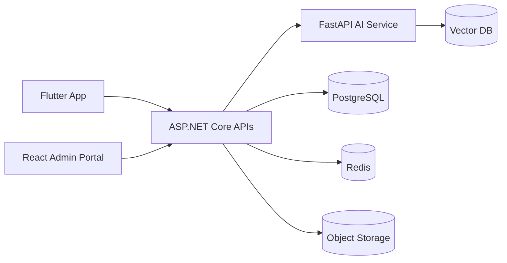

# C4 Architecture Model

## Level 1 - System Context
Actors:
- Athlete
- Coach
- Parent
- Academy
- Tournament Organizer
- Sponsor
- Admin

External Systems:
- Payment Gateway
- Email/SMS Provider
- Push Notification Service
- AI/LLM Provider

## Level 2 - Container Diagram

## Level 3 - Components
- Authentication
- Athlete
- Coach
- Academy
- Booking
- Payment
- Tournament
- Community
- Marketplace
- Notification
- Analytics
- Admin

## Integration Patterns
- REST APIs
- Event-driven messaging
- Background jobs
- WebSockets for live notifications

## Architectural Decisions (ADRs)
1. Modular Monolith initially
2. AI isolated as FastAPI service
3. PostgreSQL as primary datastore
4. Redis for caching
5. JWT authentication
