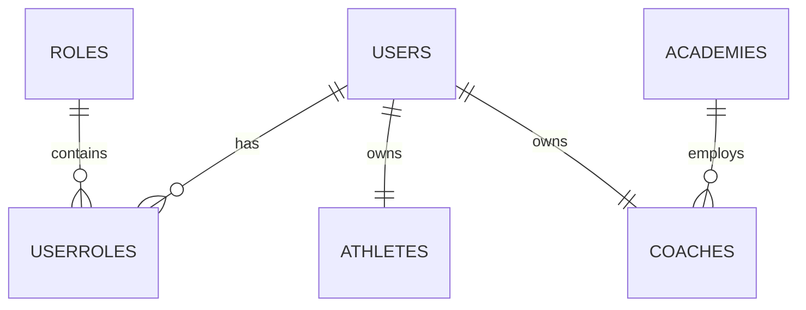

# Enterprise ERD

## Design Notes
- UUID primary keys
- Soft deletes
- Audit columns on all business tables
- Foreign key integrity
- Index frequently queried columns
- Partition large transactional tables in future
