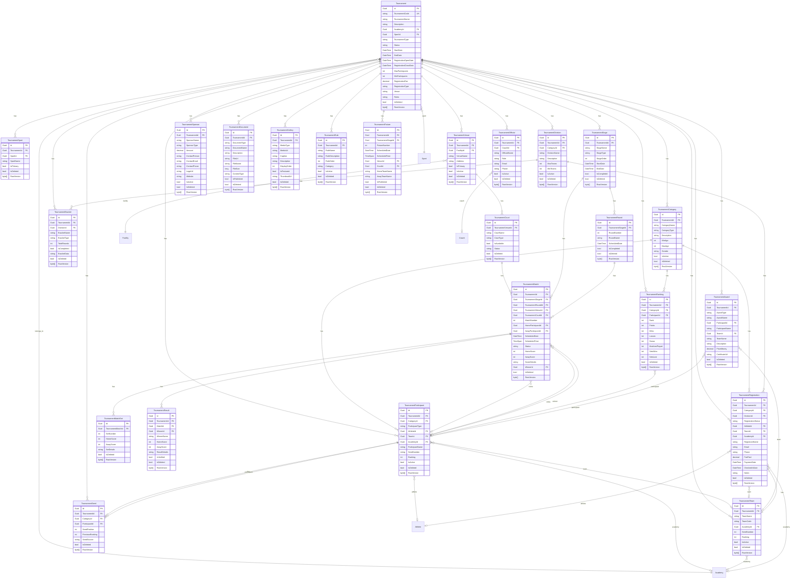

# Tournament Management - ER Diagram

```mermaid
erDiagram
    Tournament ||--o{ TournamentCategory : has
    Tournament ||--o{ TournamentSport : has
    Tournament ||--o{ TournamentDivision : has
    Tournament ||--o{ TournamentVenue : has
    Tournament ||--o{ TournamentStage : has
    Tournament ||--o{ TournamentRegistration : has
    Tournament ||--o{ TournamentParticipant : has
    Tournament ||--o{ TournamentTeam : has
    Tournament ||--o{ TournamentOfficial : has
    Tournament ||--o{ TournamentSponsor : has
    Tournament ||--o{ TournamentDocument : has
    Tournament ||--o{ TournamentGallery : has
    Tournament ||--o{ TournamentRule : has
    Tournament ||--o{ TournamentRanking : has
    Tournament ||--o{ TournamentAward : has
    Tournament ||--o{ TournamentSeed : has
    Tournament ||--o{ TournamentBracket : has
    Tournament ||--o{ TournamentFixture : has
    Tournament }o--|| Academy : belongs_to
    Tournament }o--|| Sport : sport

    TournamentCategory ||--o{ TournamentRegistration : has
    TournamentCategory ||--o{ TournamentParticipant : has
    TournamentCategory ||--o{ TournamentRanking : has

    TournamentDivision ||--o{ TournamentRegistration : has
    TournamentDivision ||--o{ TournamentBracket : has

    TournamentVenue ||--o{ TournamentCourt : has
    TournamentVenue }o--|| Facility : facility

    TournamentCourt ||--o{ TournamentMatch : has

    TournamentStage ||--o{ TournamentRound : has
    TournamentStage ||--o{ TournamentMatch : has

    TournamentRound ||--o{ TournamentMatch : has

    TournamentMatch ||--o{ TournamentMatchSet : has
    TournamentMatch ||--o{ TournamentResult : has
    TournamentMatch }o--o| TournamentParticipant : home
    TournamentMatch }o--o| TournamentParticipant : away
    TournamentMatch }o--o| TournamentParticipant : winner

    TournamentParticipant }o--o| Athlete : athlete
    TournamentParticipant }o--o| TournamentTeam : team
    TournamentParticipant }o--o| Academy : academy
    TournamentParticipant ||--o{ TournamentSeed : has

    TournamentTeam }o--o| Academy : academy
    TournamentTeam ||--o{ TournamentRegistration : has

    TournamentRegistration }o--o| Athlete : athlete
    TournamentRegistration }o--o| TournamentTeam : team
    TournamentRegistration }o--o| Academy : academy

    TournamentSeed }o--|| TournamentParticipant : participant

    TournamentRanking }o--|| TournamentParticipant : participant

    TournamentAward }o--o| TournamentParticipant : participant
    TournamentAward }o--o| TournamentTeam : team

    TournamentOfficial }o--o| Coach : coach

    Tournament {
        Guid Id PK
        string TournamentCode UK
        string TournamentName
        string Description
        Guid AcademyId FK
        Guid SportId FK
        string TournamentType
        string Status
        DateTime StartDate
        DateTime EndDate
        DateTime RegistrationOpenDate
        DateTime RegistrationCloseDate
        int MaxParticipants
        int MinParticipants
        decimal RegistrationFee
        string RegistrationType
        string Venue
        string Rules
        bool IsDeleted
        byte[] RowVersion
    }

    TournamentCategory {
        Guid Id PK
        Guid TournamentId FK
        string CategoryName
        string CategoryType
        string Description
        int MinAge
        int MaxAge
        string Gender
        bool IsActive
        bool IsDeleted
        byte[] RowVersion
    }

    TournamentSport {
        Guid Id PK
        Guid TournamentId FK
        Guid SportId FK
        string SportName
        bool IsPrimary
        bool IsDeleted
        byte[] RowVersion
    }

    TournamentDivision {
        Guid Id PK
        Guid TournamentId FK
        Guid CategoryId FK
        string DivisionName
        string Description
        int MaxTeams
        int MinTeams
        bool IsActive
        bool IsDeleted
        byte[] RowVersion
    }

    TournamentVenue {
        Guid Id PK
        Guid TournamentId FK
        Guid FacilityId FK
        string VenueName
        string Address
        bool IsPrimary
        bool IsActive
        bool IsDeleted
        byte[] RowVersion
    }

    TournamentCourt {
        Guid Id PK
        Guid TournamentVenueId FK
        string CourtName
        string CourtType
        bool IsAvailable
        string Status
        bool IsDeleted
        byte[] RowVersion
    }

    TournamentStage {
        Guid Id PK
        Guid TournamentId FK
        string StageName
        string StageType
        int StageOrder
        DateTime StartDate
        DateTime EndDate
        bool IsCompleted
        bool IsDeleted
        byte[] RowVersion
    }

    TournamentRound {
        Guid Id PK
        Guid TournamentStageId FK
        int RoundNumber
        string RoundName
        DateTime ScheduledDate
        bool IsCompleted
        bool IsDeleted
        byte[] RowVersion
    }

    TournamentMatch {
        Guid Id PK
        Guid TournamentId FK
        Guid TournamentStageId FK
        Guid TournamentRoundId FK
        Guid TournamentVenueId FK
        Guid TournamentCourtId FK
        int MatchNumber
        Guid HomeParticipantId FK
        Guid AwayParticipantId FK
        DateTime ScheduledDate
        TimeSpan ScheduledTime
        string Status
        int HomeScore
        int AwayScore
        string ScoreDetails
        Guid WinnerId FK
        bool IsDeleted
        byte[] RowVersion
    }

    TournamentMatchSet {
        Guid Id PK
        Guid TournamentMatchId FK
        int SetNumber
        int HomeScore
        int AwayScore
        string SetDetails
        bool IsDeleted
        byte[] RowVersion
    }

    TournamentFixture {
        Guid Id PK
        Guid TournamentId FK
        Guid TournamentStageId FK
        int FixtureNumber
        DateTime ScheduledDate
        TimeSpan ScheduledTime
        Guid VenueId FK
        Guid CourtId FK
        string HomeTeamName
        string AwayTeamName
        bool IsPublished
        bool IsDeleted
        byte[] RowVersion
    }

    TournamentParticipant {
        Guid Id PK
        Guid TournamentId FK
        Guid CategoryId FK
        string ParticipantType
        Guid AthleteId FK
        Guid TeamId FK
        Guid AcademyId FK
        string ParticipantName
        string SeedNumber
        int Ranking
        bool IsActive
        bool IsDeleted
        byte[] RowVersion
    }

    TournamentTeam {
        Guid Id PK
        Guid TournamentId FK
        string TeamName
        string TeamCode
        Guid AcademyId FK
        int SeedNumber
        int Ranking
        bool IsActive
        bool IsDeleted
        byte[] RowVersion
    }

    TournamentRegistration {
        Guid Id PK
        Guid TournamentId FK
        Guid CategoryId FK
        Guid DivisionId FK
        string RegistrationStatus
        Guid AthleteId FK
        Guid TeamId FK
        Guid AcademyId FK
        string RegistrantName
        string Email
        string Phone
        decimal FeePaid
        DateTime PaymentDate
        DateTime CheckedInDate
        string Notes
        bool IsDeleted
        byte[] RowVersion
    }

    TournamentSeed {
        Guid Id PK
        Guid TournamentId FK
        Guid CategoryId FK
        Guid ParticipantId FK
        int SeedPosition
        int PreviousRanking
        string SeedSource
        bool IsDeleted
        byte[] RowVersion
    }

    TournamentBracket {
        Guid Id PK
        Guid TournamentId FK
        Guid DivisionId FK
        string BracketName
        string BracketType
        int TotalRounds
        bool IsCompleted
        string BracketData
        bool IsDeleted
        byte[] RowVersion
    }

    TournamentResult {
        Guid Id PK
        Guid TournamentId FK
        Guid MatchId FK
        Guid WinnerId FK
        string WinnerName
        int HomeScore
        int AwayScore
        string ResultDetails
        bool IsVerified
        bool IsDeleted
        byte[] RowVersion
    }

    TournamentRanking {
        Guid Id PK
        Guid TournamentId FK
        Guid CategoryId FK
        Guid ParticipantId FK
        int Rank
        int Points
        int Wins
        int Losses
        int Draws
        int MatchesPlayed
        int SetsWon
        int SetsLost
        bool IsDeleted
        byte[] RowVersion
    }

    TournamentAward {
        Guid Id PK
        Guid TournamentId FK
        string AwardType
        string AwardName
        Guid ParticipantId FK
        string ParticipantName
        Guid TeamId FK
        string TeamName
        string Description
        decimal PrizeMoney
        string CertificateUrl
        bool IsDeleted
        byte[] RowVersion
    }

    TournamentOfficial {
        Guid Id PK
        Guid TournamentId FK
        Guid CoachId FK
        string OfficialName
        string Role
        string Email
        string Phone
        bool IsActive
        bool IsDeleted
        byte[] RowVersion
    }

    TournamentSponsor {
        Guid Id PK
        Guid TournamentId FK
        string SponsorName
        string SponsorType
        decimal Amount
        string ContactPerson
        string ContactEmail
        string ContactPhone
        string LogoUrl
        string Website
        bool IsActive
        bool IsDeleted
        byte[] RowVersion
    }

    TournamentDocument {
        Guid Id PK
        Guid TournamentId FK
        string DocumentType
        string DocumentName
        string Description
        string FileUrl
        string FileName
        long FileSize
        string ContentType
        bool IsPublished
        bool IsDeleted
        byte[] RowVersion
    }

    TournamentGallery {
        Guid Id PK
        Guid TournamentId FK
        string MediaType
        string MediaUrl
        string Caption
        string Description
        int DisplayOrder
        bool IsFeatured
        string ThumbnailUrl
        bool IsDeleted
        byte[] RowVersion
    }

    TournamentRule {
        Guid Id PK
        Guid TournamentId FK
        string RuleName
        string RuleDescription
        int RuleOrder
        string Category
        bool IsActive
        bool IsDeleted
        byte[] RowVersion
    }
```
